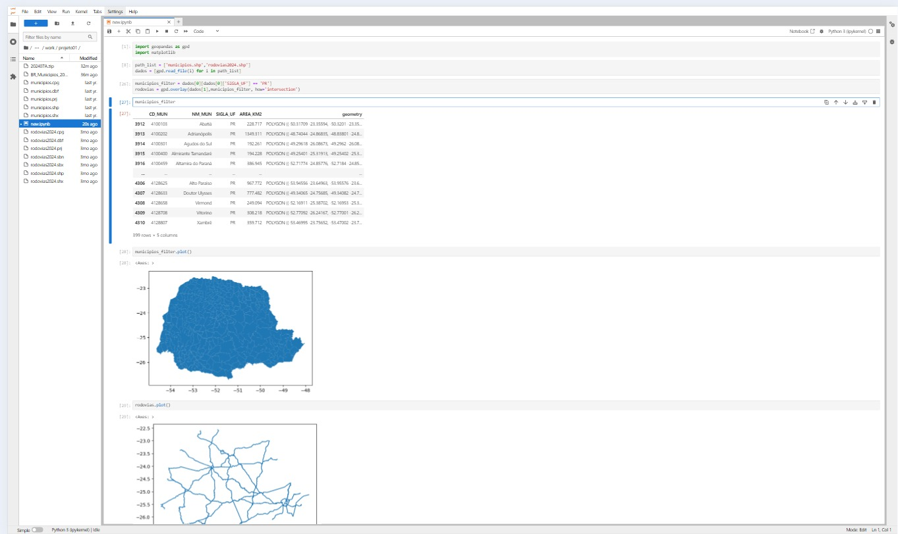

# Geoprocessamento de Dados de Municípios e Rodovias com Python

Este projeto tem como objetivo realizar geoprocessamento de dados relacionados a municípios e rodovias, utilizando a linguagem de programação Python. Utilizamos bibliotecas como `GeoPandas` e `Matplotlib` para manipular, analisar e visualizar dados geoespaciais.



## Descrição do Projeto

Este projeto permite a análise espacial de dados municipais e rodoviários, incluindo:

- Importação e visualização de dados geográficos.
- Análise de interseção entre municípios e rodovias.
- Criação de mapas para visualização dos dados.

## Executar o projeto via Docker
- Primeiro é necessario baixar os .shp so site do IBGE os municipios e rodovias 

```bash
  docker-compose up --build